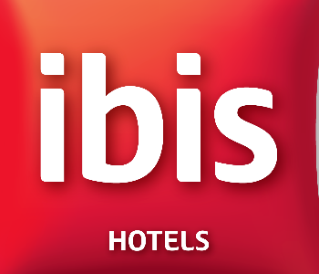
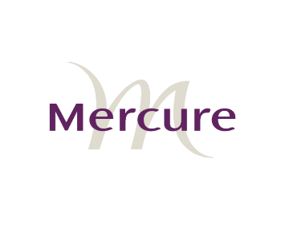

<!DOCTYPE html>
<html lang="en">
<head>
    <meta charset="UTF-8">
    <meta http-equiv="X-UA-Compatible" content="IE=edge">
    <meta name="viewport" content="width=device-width, initial-scale=1.0">

    <link rel="stylesheet" href="https://maxcdn.bootstrapcdn.com/bootstrap/3.4.1/css/bootstrap.min.css">
    
    

    <link rel="preconnect" href="https://fonts.googleapis.com">
    <link rel="preconnect" href="https://fonts.gstatic.com" crossorigin>
    <link href="https://fonts.googleapis.com/css2?family=Ubuntu&display=swap" rel="stylesheet">

    <link rel="stylesheet" href="https://cdnjs.cloudflare.com/ajax/libs/font-awesome/4.7.0/css/font-awesome.min.css">

    <!-- Font Awesome -->
    <link
    href="https://cdnjs.cloudflare.com/ajax/libs/font-awesome/5.15.1/css/all.min.css"
    rel="stylesheet"
    />
    <!-- Google Fonts -->
    <link
    href="https://fonts.googleapis.com/css?family=Roboto:300,400,500,700&display=swap"
    rel="stylesheet"
    />
    <!-- MDB -->
    <link
    href="https://cdnjs.cloudflare.com/ajax/libs/mdb-ui-kit/3.10.0/mdb.min.css"
    rel="stylesheet"
    />

    <link rel="stylesheet" href="https://pro.fontawesome.com/releases/v5.10.0/css/duotone.css" integrity="sha384-R3QzTxyukP03CMqKFe0ssp5wUvBPEyy9ZspCB+Y01fEjhMwcXixTyeot+S40+AjZ" crossorigin="anonymous"/>
    <link rel="stylesheet" href="https://pro.fontawesome.com/releases/v5.10.0/css/fontawesome.css" integrity="sha384-eHoocPgXsiuZh+Yy6+7DsKAerLXyJmu2Hadh4QYyt+8v86geixVYwFqUvMU8X90l" crossorigin="anonymous"/>

    <link rel="stylesheet" href="style.css">

    <title>Nav Theme</title>

</head>
<body>

    <nav class="navbar navbar-default">
        

            <button type="button" class="navbar-toggle" date-toggle="collapse" data-target="#myNavbar">
                
                
                
            </button>
            <a href="#" class="navbar-brand" style="color: white;">Ramanathan</a>
            

                <ul class="nav navbar-nav navbar-right">
                    <li><a href="#" style="color: white;">ONE</a></li>
                    <li><a href="#" style="color: white;">TWO</a></li>
                    <li><a href="#" style="color: white;">THREE</a></li>
                </ul>
            

        

    </nav>

    

        <h3>Ramanathan Srinivasan</h3>
        
        <h3>I am Ramanathan, Welcome to my Website</h3>
    

    

        <h3>Who am I? </h3>
        
I am Ramanathan, I am 51 years old and  
           I have been in the hotel industry for 25+ years  
        

    

    

        <h3>Food & Beverage Director until Sep-2020 </h3>
        
IBIS & ADAGIO JEDDAH MALIK ROAD/ ACCOR GROUP OF
            HOTELS.  
            255 Rooms / 4 Meeting Rooms, / SIX Outlets and Outside Catering
            Services. 
        

        <a href="#" class="btn btn-default btn-lg">
            
            Work Experience</a>
    

    

        <h3>Food & Beverage Director until Sep-2020 </h3>
        

            <li class="bps">Involved in General Administration and enforcing discipline</li>
            <li class="bps">Performing Management by objective to achieve goals laid by
                management and Head Office.</li>
            <li class="bps">Selection, Training, control staffs, merchandising, Marketing, 
                increasing revenue, Budgeting and Achieving GOP & NOP  
                To assisting Menu Planning and pricing</li>
            <li class="bps">To assisting Menu Planning and pricing</li>
            <li class="bps">QPR Results, Climate Analysis Results, , Trip Advisors Resa visions
                Results</li>
            <li class="bps">Comply all healthy and safety Regulations</li>
            <li class="bps">HACCP Certification process</li>
            <li class="bps">ISO Certification, Quality and environment systems</li>

        

    

    

        <h3>Work Experience </h3>

        

            

                
Food & Beverage Director until Sep-2020

                
            

            

                
Food & Beverage Director Dec2015 to 2019 June

                
            

            

                
Operation Manager/Dec 2014 to Oct 2015

                
            

            

                
Hotel Operation Manager/ Jan 2013 to Nov 2014

                
            

            

                
Director of FOOD & BEVERAGE MANAGER/Jan 2011 to Dec 2012.

                
            

        

    

    

        <h3>Personnel Skills & Characteristics</h3>
        <!-- <ul class="list-group">
            <li class="list-group-item">Budget Management 12</li>
            <li class="list-group-item">Excellent Listner 5</li>
            <li class="list-group-item">Friendly, Courteous and service Oriented 3</li>
            <li class="list-group-item"> Poised Under Pressure 3</li>
            <li class="list-group-item">Friendly, Courteous and service Oriented 3</li>
            <li class="list-group-item">Friendly, Courteous and service Oriented 3</li>
            <li class="list-group-item">Friendly, Courteous and service Oriented 3</li>
          </ul> -->

          <li class="bps">Budget Management</li>
          <li class="bps">Excellent Listner</li>
          <li class="bps">Friendly, Courteous and service Oriented  </li>
          <li class="bps">Poised Under Pressure</li>
          <li class="bps">Staff Training & Cpaching</li>
          <li class="bps">Recruting and Hiring Talent</li>
          <li class="bps">Quality Assurance</li>
          <li class="bps">Solid Written & Verbal Communicator</li>

    

        <h3>Professional Skills
        </h3>
        <ul class="list-group star-group">
            <li class="list-group-item"> Microsoft Office
                
                    
                    
                    
                    
                     </li>
                

            <li class="list-group-item"> Opera Catering
                
                    
                    
                    
                    
                    </li>

                

            <li class="list-group-item"> Fidelio Material control
                
                    
                    
                    
                    
                    

                
            </li>

            <li class="list-group-item"> Micros Cashiering
                
                    
                    
                    
                    
                    

                
            </li>

            <li class="list-group-item">Comsys
                
                    
                    
                    
                    
                    

                
            </li>

            <li class="list-group-item"> FoxPro
                
                    
                    
                    
                    
                    

                
            </li>

            <li class="list-group-item">Fortune Lite
                
                    
                    
                    
                    
                    

                
            </li>

            <li class="list-group-item">E-Marketing / Social Media
                
                    
                    
                    
                    
                    

                
            </li>

            <li class="list-group-item">Tally, Back Office & Front Office
                
                    
                    
                    
                    
                    

                
            </li>

          </ul>
    

    

        <h3>Eductaion</h3>
        <!-- <ul class="list-group">
            <li class="list-group-item">Budget Management 12</li>
            <li class="list-group-item">Excellent Listner 5</li>
            <li class="list-group-item">Friendly, Courteous and service Oriented 3</li>
            <li class="list-group-item"> Poised Under Pressure 3</li>
            <li class="list-group-item">Friendly, Courteous and service Oriented 3</li>
            <li class="list-group-item">Friendly, Courteous and service Oriented 3</li>
            <li class="list-group-item">Friendly, Courteous and service Oriented 3</li>
          </ul> -->

          <li class="bps">Master Degree in English Economics</li>
          <li class="bps">MBA Operations</li>
          <li class="bps">Catering </li>
          <li class="bps">HACCP</li>

    <h3>Achievements and Trainings </h3>
    

        

            

                <h4 class="panel-title">
                    <a data-toggle="collapse" href="#collapse1" style="text-align: left;">Achievements  - click to collapse</a>
                </h4>
            

            

                <ul class="list-group">
                    <li class="list-group-item">Covid-19 Hotel All Safe Inspector</li>
                    <li class="list-group-item">New Digital Menu Systems</li>
                    <li class="list-group-item">Best Team for Animations</li>
                    <li class="list-group-item">Best Environment Projects</li>
                    <li class="list-group-item">Guest Satisfaction standards</li>
                    <li class="list-group-item">Best Theme night specialties</li>
                    <li class="list-group-item">Creative in Hospitality</li>
                    <li class="list-group-item">Best Employee of the Year Sheraton hotel</li>
                </ul>
                
Achievements - click to collapse

            

        

    

    

        

            

                <h4 class="panel-title">
                    <a data-toggle="collapse" href="#collapse2" style="text-align: left;">Trainings  - click to collapse</a>
                </h4>
            

            

                <ul class="list-group">
                    <li class="list-group-item">Manage Lead Program Business school</li>
                    <li class="list-group-item">Performance Management & Competency
                        Based Interviewing skills, Business schoo</li>
                    <li class="list-group-item">Head of the Department a Manager</li>
                    <li class="list-group-item">Train the Trainer</li>
                    <li class="list-group-item">Supervision in the hospitality Industry</li>
                    <li class="list-group-item">F&B Projects</li>
                    <li class="list-group-item">Welcoming a guest; a state of mind</li>
                    <li class="list-group-item">Handling complaints</li>
                    <li class="list-group-item">P&L Reports</li>
                    <li class="list-group-item">Creativity & Critical Thinking</li>
                    <li class="list-group-item">Carlson Rezidor group, online Training</li>
                </ul>
                
Achievements

            

        

    

    <blockquote>Thanking you for the kind considerations and enclosures
        <footer style="color: white;">Ramanathan Srinivasan</footer>
    </blockquote>

    
    
    
    
    

    <footer class="container-fluid bg-10 text-center">
        
Website made by naveen <a href="https://www.google.com/">google.com</a>

    </footer>

</body>
</html>
